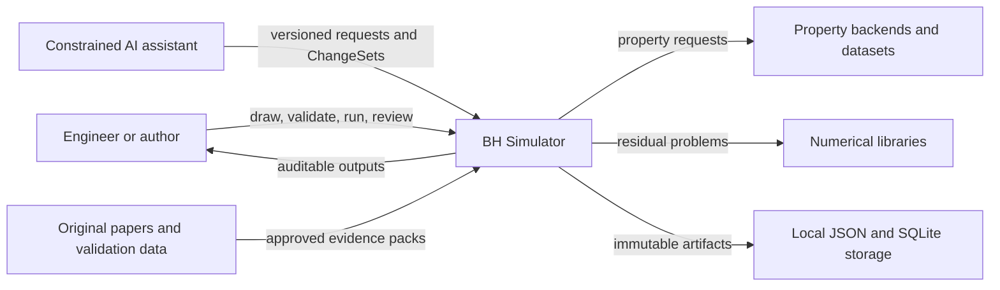
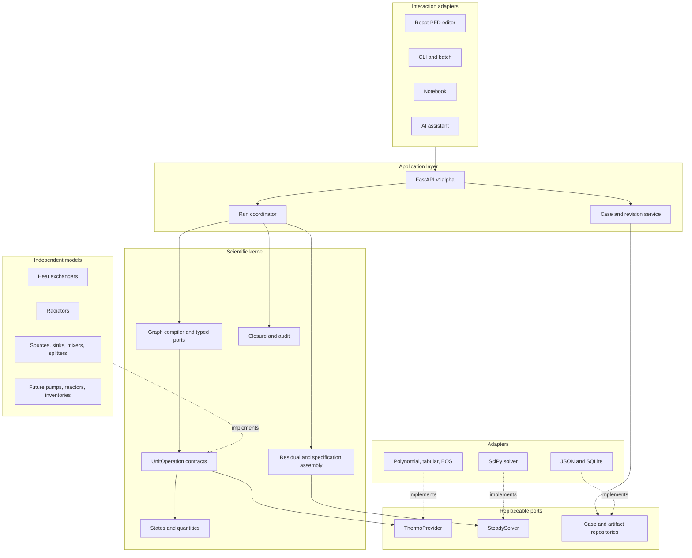
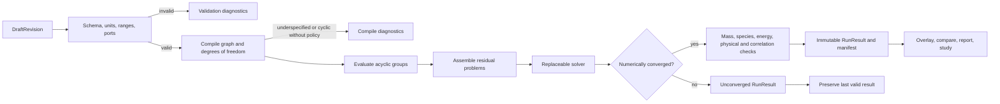
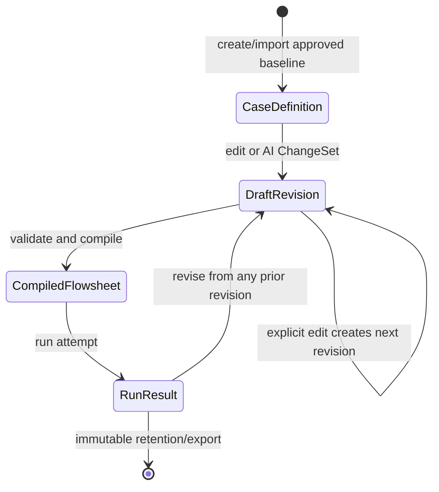
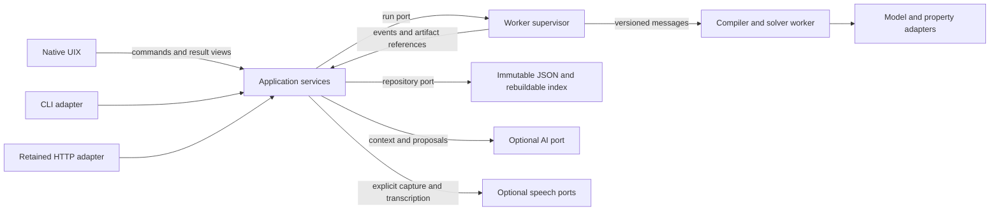
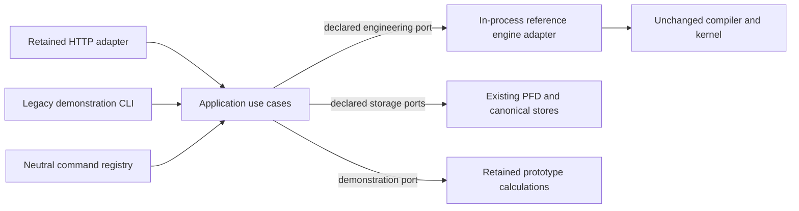

# Simulation Architecture and Dependency Plan

Status: **`v1alpha` architecture baseline**. This document defines the permitted
dependency directions. Contract details are frozen in [CONTRACTS.md](CONTRACTS.md)
and decisions are recorded in [DECISIONS.md](DECISIONS.md).

## Design rules

1. The scientific kernel owns numerical truth. Interfaces and AI may construct
   requests and explain results, but cannot replace calculated values.
2. Unit operations never locate or invoke neighbouring equipment. They read typed
   inlet states and parameters and return typed evaluations.
3. The graph coordinator owns validation, sequencing, specifications, recycles,
   solver orchestration, and run state.
4. Dependencies point inward to stable contracts. UI, storage, property packages,
   solvers, and reports are replaceable adapters.
5. Cases and completed results are immutable; editing creates a new draft revision.

## System context

The simulator is a local modular monolith. The Python package, local API, browser
PFD, and persistence adapters may run as separate processes, but are released and
versioned together. External services are never required to reproduce a stored
kernel calculation unless its run manifest explicitly identifies a user-installed
backend.

## Component map

Solid arrows are permitted runtime imports or calls. Dotted arrows mean an
implementation of a declared contract. NetworkX is private to graph compilation;
Pydantic and Pint are boundary tools; NumPy arrays are private numerical state.
None of their objects appear in persisted `v1alpha` schemas.

## Runtime calculation flow

Upstream and downstream equipment exchange typed port states only. Studies—pinch,
exergy, uncertainty, HAZOP, and dynamics—consume immutable cases or results. They
do not become dependencies of unit models or silently mutate a baseline.

## State lifecycle

- `CaseDefinition` is an immutable, approved or imported process definition.
- `DraftRevision` records its parent, ordered changes, author, and editing profile.
- `CompiledFlowsheet` is ephemeral derived state: ordered groups, variable map,
  degrees of freedom, and recycle groups. It is never canonical persistence.
- `RunResult` is an immutable record of an attempted run, including unsuccessful
  attempts, while the application separately points to the last valid result.

## Layer and dependency rules

| Layer | May depend on | Must not depend on |
|---|---|---|
| Domain contracts | Python standard library and domain value types | API, UI, persistence, SciPy, NetworkX, concrete property packages |
| Unit models | Domain contracts, mathematical utilities, thermo port | Adjacent units, graph traversal, UI, repository, concrete solver |
| Graph/compiler | Domain contracts, private NetworkX adapter | UI objects, storage records, unit-specific equations |
| Solver adapters | Residual contracts, NumPy/SciPy | UI, persistence, unit discovery |
| Application services | Domain contracts and declared ports | Browser components and database implementation details |
| API/UI/AI | Application API schemas | Kernel internals and engineering equations |
| Reporting/studies | Immutable cases and run results | Mutable drafts and unit execution control |

Every replaceable boundary requires contract tests. Every model requires declared
assumptions, validity limits, provenance, limiting-case tests, and closure checks.
The [failure policy](FAILURE_RECOVERY.md) defines behaviour when a boundary fails.

## Current prototype and migration boundary

The current `thermo.py`, `stream.py`, `unit_ops.py`, `radiators.py`,
`transients.py`, and `audit.py` modules are prototype references. Their equations
remain useful, but their concrete Python objects and report dictionaries are not
the stable public API. They must be adapted behind `v1alpha` contracts before the
flowsheet engine or PFD depends on them.

## Architecture gate

The baseline is ready for implementation only when all items below are reviewed:

- [Vocabulary](VOCABULARY.md)
- [Architecture decisions](DECISIONS.md)
- [Public contracts](CONTRACTS.md)
- [Model lifecycle](MODEL_LIFECYCLE.md)
- [Requirements and verification matrix](REQUIREMENTS_VERIFICATION.md)
- [PFD interaction specification](PFD_SPECIFICATION.md)
- [Dependency and licence register](DEPENDENCY_REGISTER.md)
- [Failure containment and recovery](FAILURE_RECOVERY.md)
- [Milestone backlog](MILESTONES.md)

The gate passes when the architecture steward marks every `GATE-*` requirement
in the verification matrix complete and another engineer can implement the first
vertical slice without choosing formats, interfaces, dependency directions, or
failure behaviour.

## DW0 proposed native architecture

Status: **ACCEPTED TARGET DIRECTION**, under
[ADR-010](DECISIONS.md#adr-010--native-workstation-and-independent-uixsolver-boundary)
and the owner's 2026-09-11 annotations. The diagrams above record the original
`v1alpha` browser baseline; the target below governs staged migration. Target
components do not imply completed implementation or a passed desktop gate.

These are runtime calls/messages, not permission for service policy to import
concrete adapters. Source dependencies point inward:

| Layer | Allowed dependencies | Enforcement planned |
|---|---|---|
| Neutral boundary | Standard library and individually reviewed schema/value types | Imports in an environment without Qt, Pint or numerical backends |
| UIX | Neutral DTOs/commands and desktop-only presentation libraries | Recursive import and independent UI build tests |
| Application policy | Neutral/domain contracts and declared repository/run/provider ports | Reject concrete Qt, solver, persistence and provider imports |
| Worker host | Worker protocol and kernel composition | Version fixtures and malformed-message rejection |
| Kernel and numerical/property adapters | Existing domain contracts and inward numerical ports | Tests in an environment without Qt, AI or speech dependencies |
| Composition root | Concrete adapters needed to bind the declared ports | Small, explicitly enumerated wiring modules; no engineering policy |

The UI process retains editing/layout state; application services own use-case
policy; the worker owns compile/evaluate state. The full accepted calculation
artifact is authoritative; bounded/decimated telemetry is presentation only.
The current `core.quantity` imports Pint, so re-exporting `core` would not create
the proposed neutral boundary. Move no source families until DW1 fixtures exist.

See [DW0 impact and sequence](native/DW0_REVIEW.md) for the current discrepancies,
the staged in-process run port, mock desktop services and later worker transition.

## DW1 implementation boundary

The [DW1 specification](native/DW1_BOUNDARY.md) defines the first neutral command
slice. Its current runtime path is synchronous and in-process:

`boundary/` contains standard-library-only immutable DTOs and a strict versioned
codec. `application/` contains policy and ports; `adapters/` translates scientific
and persisted objects, and `composition.py` wires their concrete implementations.
Root-package compatibility exports load lazily so a neutral import does not load
scientific libraries. The shared registry is available to later native adapters;
HTTP compatibility use cases preserve the browser's current explicit actions and
payloads. The [change record](native/DW1_CHANGE_RECORD.md) distinguishes tested
behavior from the later worker, native shell and distribution gates.

## DW2 implementation boundary

The [native shell](native/DW2_SHELL.md) now consumes a neutral `CommandGateway`.
`uix/` imports only standard-library modules, its own presentation code, neutral
boundary types and Qt Core/Gui/Widgets. Menus, toolbar, palette and shortcuts
share `QAction` instances; draft actions dispatch to the shared application
registry. Widget and workspace settings remain private to UIX.

`desktop_launcher.py` wires the shell through `adapters/desktop_preview.py`.
That composition uses real draft repository ports with unavailable mock
engineering/result ports. It does not import the scientific composition root.
The legacy draft store is separated into `adapters/drafts.py`, with old imports
retained through re-exports; no storage format changes. The preview supports
create/list/open/save only. Disabled calculation controls cannot generate
synthetic results or advance a last-valid pointer.

Recursive import checks and a fresh-process create/save/open test with scientific
and FastAPI imports blocked enforce this scope. The
[DW2 evidence](native/DW2_CHANGE_RECORD.md) distinguishes those software checks
from native OS interaction, worker process separation and standalone distribution.
