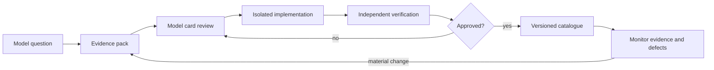

# Scientific Model Lifecycle

Passing software tests does not approve a scientific model. Promotion follows the
controlled path below; narrative models may stop at any stage but retain labels.

## Required artifacts

| Gate | Owner | Required content | Exit condition |
|---|---|---|---|
| Evidence pack | Evidence analyst | Intended question; original sources; extracted equations/data with units; uncertainty; contradictions; licence; established/extrapolated/speculative classification | Sources are traceable and evidence gaps explicit |
| Model card | Architecture steward + domain reviewer | Model ID/version; equations; inputs/outputs; assumptions; validity domain; extrapolation policy; failure behaviour; provenance; test cases; exclusions | Card approved before production implementation |
| Implementation | Model/numerical engineer | Unit contract implementation; source references; model/data versions; audit substitutions; no hidden I/O | Contract, dimensional, limiting-case, and closure tests pass |
| Independent V&V | V&V reviewer | Hand calculation or independent implementation; benchmark comparison; sensitivity at bounds; defect report | Reviewer signs exact model/data/code versions |
| Catalogue | Architecture steward | Approved card, evidence and V&V hashes; profile permissions; deprecation status | Registration is explicit and immutable |

The implementer cannot be the sole V&V reviewer. Reviewers report discrepancies
rather than repairing implementation under review. One owner controls each file
family during a work package.

## Model status

`DRAFT`, `EVIDENCE_REVIEW`, `IMPLEMENTED_UNVERIFIED`, `VERIFIED`, `APPROVED`,
`DEPRECATED`, or `REJECTED`. Only `APPROVED` models are available in research or
future release catalogues. Narrative runs may use earlier statuses only when
the model and every result are visibly `SPECULATIVE`.

## Change control

- Equation, coefficient, data-source, phase behaviour, or validity changes create
  a new model version and repeat evidence and V&V.
- Documentation-only clarification may retain the version if numerical behaviour
  and interpretation are unchanged; record the review.
- Defects deprecate the affected catalogue entry, preserve old run artifacts, and
  prevent new use unless an explicit reproducibility override is recorded.
- The [model register](MODEL_REGISTER.md) is the human index; catalogue metadata
  and hashes are the machine authority.
