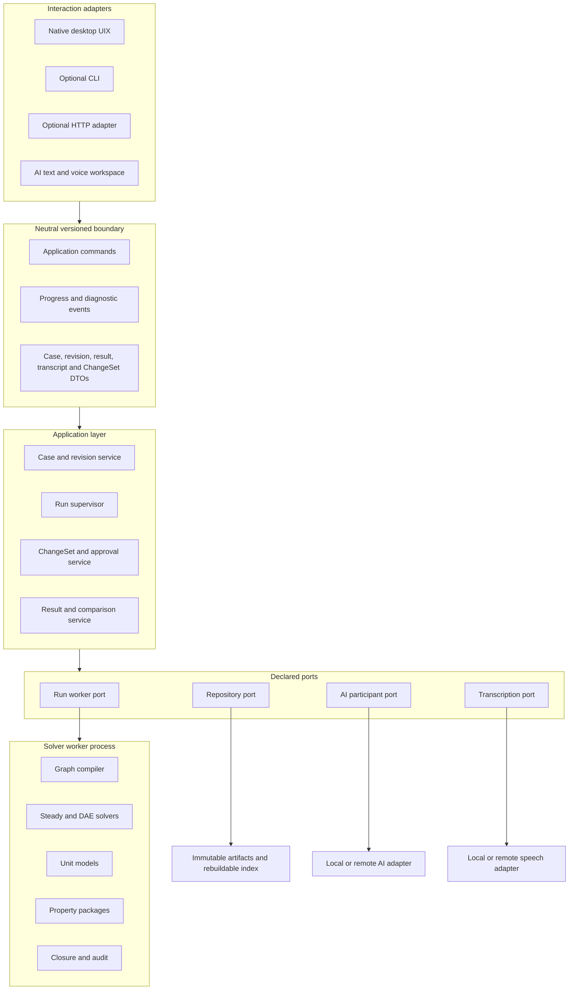

# BH Native Workstation and Auditable AI Action Plan

Status: **DW0 DIRECTION APPROVED; STAGED IMPLEMENTATION AND LATER GATES REMAIN**  
Date: **2026-09-10**  
Purpose: provide an execution-ready plan for replacing the browser-first Process
Studio with a native, all-in-one engineering workstation while preserving the
scientific and governance boundaries already established for BH.

This document records Rayla May's intent and staged implementation work.
ADR-010 records the accepted architecture direction; this plan does not approve
scientific models or industrial use. Technology benchmarks, exact dependency
payloads, providers and later release decisions retain their stated gates.

DW0 was prepared on 2026-09-10 and [approved with annotations from Rayla May](native/DW0_OWNER_DISPOSITION.md)
on 2026-09-11, authorizing DW1. The working name is BH solver. First release is
macOS/arm64; architecture anticipates Windows/x86_64 and Linux support. Minimums
are deferred to deployable-build review. Qt/PySide follows LGPLv3; BH-owned source-available,
non-commercial project material follows the adopted root license.
See [ADR-010](DECISIONS.md#adr-010--native-workstation-and-independent-uixsolver-boundary)
and the dated [browser parity inventory](native/BROWSER_PARITY.md).

## 1. How the receiving project chat should use this plan

The receiving chat or implementation agent shall:

1. Read this plan and the normative documents listed in Section 16 before editing
   architecture or code.
2. Treat Section 2 as constraints Rayla May set unless she explicitly changes
   them.
3. Treat rendering technologies, numerical performance figures, provider choices,
   and deployment frequencies as proposals requiring the stated research or review
   gates.
4. Preserve accepted ADR history. Add a superseding ADR for the desktop transition;
   do not rewrite ADR-008 as though the browser decision never existed.
5. Execute work in the phases in Section 12. Do not remove the existing React/FastAPI
   slice until native parity, artifact compatibility, and rollback requirements pass.
6. Keep each change small enough to review and accompany it with the change record
   in Appendix A.
7. Stop at a decision gate rather than selecting licensing, supported
   platforms, retention policy, or AI data policy without authority.

## 2. Binding constraints set by Rayla May

### 2.1 Product and interaction

- BH shall become an all-in-one workstation application with no web
  browser required for normal use.
- Normal graphical use shall not require a terminal, command prompt, Python
  installation, Node installation, or manual server startup.
- The CLI may remain as an optional peer interface for automation, testing, and
  advanced users.
- The primary workflow shall suit chemical and mechanical engineers accustomed to
  a flowsheet canvas, property inspectors, workbooks, menus, context menus, and
  keyboard shortcuts.
- Validation and Run shall remain explicit actions. Editing shall not trigger an
  implicit solve or approval.
- Presentation-only edits shall not invalidate engineering results. Engineering
  edits shall stale validation for the affected content hash.

### 2.2 Independence of UIX and solver

- The UIX layer shall not import, embed, or depend on solver implementations,
  property-package implementations, graph algorithms, numerical arrays, or their
  concrete runtime objects.
- The solver layer and layers below it shall not import or depend on Qt, UI view
  models, widget state, keyboard mappings, AI panels, speech controls, or other
  presentation concerns.
- UIX and solver may both depend on a small, neutral, versioned contract package.
- Communication shall occur through application commands, immutable artifacts,
  typed events, or a versioned worker protocol.
- Tight numerical coupling is permitted only where computationally justified. In
  particular, a DAE solver and the property packages called inside residual or
  Jacobian evaluations should normally execute in the same worker process.
- A single installer may contain multiple internal processes. Distribution unity
  shall not be confused with code or process coupling.

### 2.3 AI authority and HAZOP role

- AI shall assist qualified people and shall not replace engineering authority.
- The HAZOP AI mode is an additional, attributable participant. It is not a generic
  chatbot, a copilot that silently edits the model, a Monte Carlo engine, or an
  approval authority.
- AI-generated engineering changes shall be proposed through versioned `ChangeSet`
  or scenario contracts and reviewed before application.
- AI shall not supply kernel results, conceal solver status, suppress diagnostics,
  approve models, approve cases, alter canon, or promote industrial use.
- A multi-participant or mixture-of-experts workflow shall preserve each
  participant's output and disagreement. It shall not reduce the record to a
  synthetic consensus.
- The number of active AI participants, runs, elapsed time, and tool calls shall be
  bounded so the engineering session cannot stall indefinitely.

### 2.4 Text, voice, and accessibility

- Typing shall always remain available; speech shall be optional.
- The AI text composer shall support multiline editing, spellchecking, a project
  technical dictionary, and review before sending.
- Voice conversation mode and transcript-first mode shall be distinct workflows.
- Recorded audio and transcripts shall not be sent, retained, or reused for
  training without a visible policy and explicit user action appropriate to that
  policy.
- All essential UI operations shall be keyboard reachable, focus-visible, and
  identifiable without relying on colour alone.

### 2.5 Auditability and legibility

- Engineering behaviour, scientific assumptions, AI proposals, code changes,
  model provenance, test evidence, and human approvals shall be traceable.
- AI-produced code shall be readable, typed where practical, documented, and
  structured so another person can safely edit and extend it.
- “Auditable reasoning” means an explicit record of intent, assumptions, evidence,
  alternatives, decision rationale, operations, outputs, uncertainty, and review.
  Hidden model chain-of-thought is not a project artifact and shall not be required
  as the audit mechanism.
- Numerical code shall connect implementation to model cards, equations, units,
  validity domains, and verification evidence.

## 3. Target architecture

The target is a modular desktop product whose dependencies point toward stable
contracts and application policy.



### 3.1 Dependency rules

| Component | May depend on | Must not depend on |
|---|---|---|
| Neutral boundary | Standard library and reviewed schema/value types | Qt, solver implementations, SciPy, NetworkX, property backends |
| Desktop UIX | Neutral boundary and desktop-only libraries | Solver, engine, model equations, persistence implementations |
| Application layer | Neutral/domain contracts and declared ports | Qt widgets, concrete solver, concrete AI/speech provider |
| Solver worker | Domain contracts, compiler, models, numerical and property ports | Desktop UIX, AI widgets, speech widgets, shortcut definitions |
| AI participant adapter | AI contracts and approved context/tool ports | Direct case mutation, direct numerical authority, UI internals |
| Speech adapter | Audio/transcript contracts | Solver and case mutation |
| CLI and HTTP adapters | Application commands and result DTOs | Direct solver implementation calls |

### 3.2 Runtime topology

The proposed packaged runtime is:

1. A native desktop process owns windows, commands, editing state, and presentation.
2. A supervised worker process performs compile, solve, property, closure, and audit
   work.
3. AI and transcription providers run behind replaceable ports. Network providers
   are optional capabilities, not kernel dependencies.
4. JSON remains canonical for bounded artifacts. Large transient arrays use a
   separately approved immutable binary sidecar referenced by content hash.
5. The desktop application starts, monitors, cancels, and restarts its worker without
   exposing process management to the user.

The process boundary protects the UI from long runs and native numerical-library
failures. It is not permission to create an undocumented distributed system.

## 4. Proposed implementation technologies

ADR-010 accepts the native direction and Rayla May has selected the Qt LGPLv3
route. Exact dependency payloads and the technology-specific evidence below remain
subject to review:

| Concern | Proposed choice | Reason and gate |
|---|---|---|
| Desktop shell | PySide6 with Qt 6 Widgets | Dense desktop controls, docking, menus, tables, focus and shortcuts; LGPLv3 route selected, exact payload/compliance review required |
| PFD canvas | `QGraphicsView`/`QGraphicsScene` | Mature interactive 2D scene; must pass representative rendering spike |
| Optional acceleration | `QOpenGLWidget` viewport | Research candidate only; compare correctness and performance with raster viewport |
| Selective dynamic UI | Qt Quick/QML | Use only where it provides measured value, such as a waveform or specialised visual surface |
| Commands | Application command registry plus `QAction` bindings | One behaviour shared by buttons, menus, hotkeys, command palette, AI and CLI |
| Solver isolation | Spawned worker with framed typed messages | Keeps UI responsive and enforces the dependency boundary |
| Bulk numerical output | Content-addressed binary artifact or memory mapping | Avoid copying large DAE trajectories through UI messages; requires format ADR |
| Spellcheck | `SpellcheckProvider` with platform or reviewed dictionary adapter | Keeps editor independent and supports technical dictionaries |
| Audio capture | `AudioCapturePort` implemented with reviewed desktop audio library | Keeps device and platform details out of AI logic |
| AI and STT | Provider interfaces with local and/or remote adapters | Avoid provider lock-in and permit restricted industrial profiles |
| Packaging | Signed platform application/installer containing runtime and workers | No terminal or dependency installation for normal use |

Rayla May selected the LGPLv3 route for Qt/PySide and excludes dependencies
requiring commercial licence terms at this stage. Verify the exact selected
modules, binaries, third-party notices and applicable obligations before adoption
and distribution. If the payload cannot satisfy that route, return the concrete
issue for a toolkit decision; do not purchase commercial terms by inference.
The adopted BH project license does not restrict upstream LGPL rights.

## 5. Proposed source layout

Do not perform a large directory move before contract tests exist. Evolve toward:

```text
src/bh_sim/
    boundary/                 # neutral commands, events and serialized DTOs
    core/                     # scientific/domain values and policies
    application/              # use cases and orchestration through ports
    engine/                   # compiler and run-domain coordination
    solvers/                  # replaceable steady/DAE implementations
    persistence/              # repository adapters
    worker/                   # solver-worker host and protocol adapter
    adapters/
        desktop/              # Qt UIX only
        cli/                  # optional CLI adapter
        http/                 # optional FastAPI adapter
        ai/                   # AI providers and participant orchestration
        speech/               # capture and transcription providers
```

The final installer may bundle all required modules while import-boundary tests keep
them logically independent. A later multi-package split is optional and should be
driven by enforcement or distribution needs, not aesthetics.

## 6. Contract work

The existing domain artifacts remain authoritative. Add versioned contracts only
where the desktop and worker boundary requires them.

### 6.1 Application command contracts

At minimum, define commands for:

- Create, open, save, clone, import, and export case or draft.
- Add, remove, move, connect, disconnect, and configure flowsheet objects.
- Validate an exact engineering content hash.
- Start, cancel, and inspect a run.
- Select and compare revisions and runs.
- Apply, reject, or revise an AI `ChangeSet`.
- Attach explicit context to an AI participant request.
- Start, stop, save, transcribe, edit, and submit an audio transcript.

Every command shall have a stable command name, schema version, request ID, actor,
target revision/hash when relevant, parameters, and defined success/failure result.

### 6.2 Worker contracts

Define a small protocol containing:

- `WorkerHello` and capability/version negotiation.
- `RunJob`, including immutable case/revision identity and solver configuration.
- `RunAccepted`, `RunProgress`, `RunDiagnostic`, `RunCompleted`, `RunFailed`, and
  `RunCancelled` events.
- `CancelRun` with deterministic safe-boundary semantics.
- `WorkerFault` without credentials or unrestricted local paths.
- References to large immutable output artifacts rather than embedding large arrays.

Worker messages shall not contain Qt types. Worker implementations shall not receive
widget IDs or presentation layout.

### 6.3 AI participant contracts

Add contracts for:

- Participant identity, provider, model/version, role and profile.
- The exact user question and explicitly attached engineering context.
- Assumptions, evidence references, proposed deviation, expected consequence, and
  uncertainty statement.
- A structured scenario or `ChangeSet`, never an untyped instruction to mutate the
  solver.
- Tool requests and returned artifact IDs.
- Individual participant responses and dissent links.
- Human disposition: accepted for test, edited, rejected, deferred, or escalated.

### 6.4 Transcript contracts

Record:

- Transcript ID, mode, timestamps, locale and optional speaker labels.
- Audio artifact reference and retention status where recording is retained.
- Provider and transcription model/version.
- Draft text, edits, user-approved submitted text, and submission time.
- Explicit links to any AI session or `ChangeSet` created from the transcript.

## 7. Native workstation UX specification

### 7.1 Main layout

The default workspace should provide:

```text
+---------------- case / revision / profile / search -------------------+
| Navigator |                     Flowsheet                    | Inspector |
| Catalogue |                                                  | Context   |
| Revisions |                                                  | Evidence  |
| Runs      |                                                  | Validity  |
+-----------+--------------------------------------------------+----------+
| Workbooks / Diagnostics / Convergence / Results / AI / Transcript      |
+-------------------------------------------------------------------------+
| content hash | validation | solver state | closure | validity | units   |
+-------------------------------------------------------------------------+
```

Panels shall be dockable, resizable, hideable, keyboard reachable, and restorable
from user workspace layouts. The application shall offer a usable default layout so
customisation is optional.

### 7.2 Workspaces and layers

Planned workspaces are enabled only when their underlying contracts and engines are
ready:

1. Process flowsheet and steady-state results.
2. Dynamics and inventories.
3. Controls and signal diagrams.
4. Safety/HAZOP deviations and safeguards.
5. Studies, comparisons and uncertainty.

Selectable visual layers may include temperature, pressure, mass flow, duty,
phase, convergence, closure, physical validity, correlation validity, control
signals, safeguards, and deviation heatmaps. A disabled future layer shall be
labelled unavailable; it shall not display invented placeholder calculations.

### 7.3 Command-first interaction

Each action is implemented once in the application command registry and exposed as
appropriate through toolbar, menu, context menu, hotkey, command palette, AI
proposal, and optional CLI. Hotkeys invoke the command; they do not duplicate its
logic.

Provide searchable command discovery and a keyboard-shortcut editor. Reserve common
platform conventions for save, open, undo, redo, copy, paste, find, and help. Assign
solver-specific defaults only after conflict and accessibility review.

### 7.4 Engineering state presentation

- Display value and unit separately and preserve explicit unit conversion.
- Show stale, invalid, extrapolated, unconverged, cancelled, failed, and not-run
  states with text/icons in addition to colour.
- Selecting a diagnostic focuses its object and field when possible.
- A failed run remains inspectable and never replaces the last-valid overlay.
- The active result, failed attempt, baseline revision, and comparison target shall
  always be visually distinguishable.
- Presentation autosave may restore workspace state but shall not approve, validate,
  or run engineering content.

### 7.5 Contemporary design system

Create a small versioned design system rather than relying on default widget
appearance. Define typography, spacing, density, iconography, focus rings, state
colours, charts, selection, warnings, high contrast, dark/light themes, reduced
motion, and minimum target sizes. Prefer information density and predictable
interaction over decorative animation.

## 8. PFD rendering and telemetry research plan

Claims such as “10,000 items at 144 Hz at 4K” are research targets, not accepted
capabilities. Create representative benchmark fixtures and compare:

1. Raster `QGraphicsView` with conservative update mode.
2. `QGraphicsView` using `QOpenGLWidget` with `FullViewportUpdate`.
3. `QGraphicsView` using `QOpenGLWidget` with measured alternative update modes.
4. A limited Qt Quick scene-graph prototype only if the first three miss the agreed
   target.
5. A native Metal prototype only if macOS remains a required primary platform and
   profiling shows an unresolved renderer bottleneck worth the platform coupling.

Benchmark small, representative and stress scenes. Record:

- Equipment, port, stream-segment, label and overlay counts.
- Pan, zoom, select, drag, route and overlay-update workloads.
- Median, 95th and 99th percentile frame time.
- Input-to-paint latency, CPU/GPU load, memory use and dropped frames.
- Visual correctness, text quality, hit testing, printing/export and accessibility.
- Behaviour on each supported OS/GPU class.

Choose the simplest renderer that passes the reference workload Rayla May approved.
Keep rendering behind a presentation interface so the choice does not affect case or
solver contracts.

Solver stepping and UI refresh shall be independent:

```text
solver steps -> immutable/full trajectory storage
             -> telemetry sampler/decimator -> bounded UI event queue -> render
```

The solver shall not calculate at a frequency selected to satisfy animation. UI
publication should default to a bounded human-visible rate and remain configurable.
The full accepted trajectory, not the decimated display feed, is the calculation
artifact.

## 9. AI and HAZOP interaction plan

### 9.1 Text workspace

Provide a dockable AI workspace with:

- Multiline, spellchecked composition.
- Project glossary and user dictionary; units and chemical identifiers shall not be
  silently autocorrected.
- Context chips for selected node, equipment, stream, revision, run, result,
  diagnostic, evidence pack or model card.
- Editable prompt history and exportable session records.
- Explicit modes aligned with `REVIEW`, `EXPLORATION`, and `NARRATIVE` authority.
- A side-by-side proposal review showing original and proposed values, units,
  affected objects, rationale, expected consequence and required validation.

### 9.2 Example HAZOP flow

For a question such as “What happens downstream if water temperature is greater
than or equal to 37 degrees Celsius?” the application shall:

1. Capture the exact question and selected node/context.
2. Ask the participant to identify the intended variable, boundary, units,
   comparison condition, time basis, assumptions and missing specifications.
3. Produce a structured scenario proposal or bounded exploration plan.
4. Show the proposed case changes and assumptions to the HAZOP lead.
5. Apply approved changes to an isolated revision.
6. Validate and run only through the normal run coordinator.
7. Present downstream calculated effects, validity, closure, convergence and
   provenance.
8. Record the participant suggestion, human edits, run IDs and final disposition.

The AI shall not translate an ambiguous spoken phrase directly into an authoritative
case mutation.

### 9.3 Multiple participants

- Configure a small maximum participant count approved by Rayla May.
- Give each participant a declared role or heuristic lens.
- Run participants independently where possible.
- Preserve each response before any synthesis step.
- Display agreement and disagreement as mappings, not a consensus score.
- Permit the HAZOP lead to question, accept, edit, reject or defer each proposal.
- Bound elapsed time, tokens, tool calls, solver runs and retries.
- If one participant fails, retain the others and report the failure explicitly.

### 9.4 AI audit record

For every material AI contribution, retain:

- Session and participant IDs.
- Provider/model/version and configured profile.
- User input and attached context hashes.
- Explicit assumptions and evidence references.
- Concise engineering rationale supplied for review.
- Tool requests and returned artifact IDs.
- Proposed and approved changes.
- Solver run IDs and result statuses.
- Uncertainty, dissent and unresolved questions.
- Human reviewer and disposition.

Provider-private hidden reasoning is neither required nor represented as evidence.

## 10. Speech and transcript plan

### 10.1 Conversation mode

- Offer push-to-talk first; consider hands-free turn detection after usability and
  false-trigger testing.
- Display recording, network/transcription, final-turn and send states visibly.
- Show partial text while recording and final committed text before or as it is sent,
  according to an explicit user setting.
- Voice-originated engineering actions follow the same proposal and approval path as
  typed requests.
- Spoken AI output is optional and independently disableable.

### 10.2 Transcript-first mode

- Record without sending content to the AI.
- Produce a timestamped editable transcript.
- Support technical spellcheck, find/replace, annotations, section selection and
  “send selection” as well as “send approved transcript.”
- Preserve original transcript output separately from human edits when retention is
  enabled.
- Clearly identify whether audio is local-only, uploaded, deleted, or retained.

### 10.3 Provider boundary

Define separate `AudioCapturePort`, `TranscriptionPort`, and `ConversationPort`
interfaces. A local recorder may feed either an offline engine or a remote provider.
Provider choice shall not change HAZOP, case, solver, or audit contracts.

## 11. Code and documentation audit standard

This section applies to human- and AI-authored changes.

### 11.1 Traceability

Every material change shall identify:

1. The requirement, defect, model card, ADR or instruction from Rayla May that motivates it.
2. The affected architectural boundary.
3. Assumptions and constraints.
4. The selected design and concise rationale.
5. Material alternatives considered and why they were not selected.
6. Files and public contracts changed.
7. Tests, benchmarks or review evidence produced.
8. Risks, compatibility impact, migration and rollback.
9. Remaining questions and known limitations.

This information belongs in ADRs, model cards, change records, code documentation,
tests and review summaries. It shall not exist only in a transient chat.

### 11.2 Source-code legibility

- Use descriptive domain names and complete type annotations at public boundaries.
- Keep functions and classes focused on one responsibility.
- Document public modules, classes, commands, ports and non-obvious functions.
- Docstrings describe purpose, inputs, outputs, units, side effects, failure modes
  and relevant contract/model references; they do not narrate obvious syntax.
- Explain why a non-obvious algorithm, tolerance, optimisation or workaround exists.
- Replace unexplained constants with named values linked to evidence, configuration,
  model cards or an explicit UI design token.
- Numerical code states expected dimensions, scaling, validity range and behaviour at
  limits.
- UI code contains no scientific equations. Display transformations are identified
  as presentation-only.
- Comments shall not claim tests, performance, safety or validation that has not been
  demonstrated.
- Generated code is clearly identified, reproducible where practical, and reviewed
  to the same standard as handwritten code.
- Avoid broad “helper” modules that conceal dependencies. Place adapters at explicit
  boundaries.
- Error handling returns typed diagnostics and preserves original causes without
  leaking credentials or unrestricted paths.

### 11.3 AI code-output requirements

An AI implementation response shall provide a human-readable change record using
Appendix A. It shall also:

- State what changed before describing implementation details.
- Link changed files and relevant documentation.
- Identify any inferred requirement or assumption.
- Separate verified facts from proposals and untested expectations.
- Include exact tests run and their outcomes.
- Report tests not run and why.
- Avoid presenting hidden chain-of-thought as engineering evidence.
- Provide an editable rationale: requirements, constraints, alternatives, decision,
  consequences and evidence.
- Avoid unexplained bulk rewrites. Mechanical changes shall be identified as such.
- Preserve unrelated user changes and disclose overlap.

### 11.4 Scientific implementation requirements

Each scientific implementation shall reference an approved model card and provide:

- Equation or algorithm identifiers matching the card.
- Input/output quantities and canonical units.
- Assumptions, phase/component basis and validity limits.
- Scaling and initialisation rules.
- Limiting-case, dimensional, closure and benchmark tests.
- Provenance for coefficients and datasets.
- Deterministic failure behaviour for invalid, extrapolated and non-finite states.

Code comments and `AuditEvidence` support reconstruction but do not replace
independent V&V.

### 11.5 Reviewability gates

A change is not review-ready when:

- Its purpose cannot be linked to a requirement or defect.
- It changes a public contract without schema/version/migration analysis.
- It crosses a forbidden import boundary.
- Numerical constants lack units or provenance.
- It changes behaviour without tests or a stated verification gap.
- Its only explanation is a chat transcript or a claim that the AI “reasoned” about
  it.

## 12. Phased execution plan

Phases below are desktop-workstream gates. They complement rather than renumber the
existing M0-M9 scientific milestones.

### DW0 — Decision and baseline gate

Deliverables:

- Add a superseding ADR for native desktop interaction and UIX/solver independence.
- Update architecture diagrams, terminology, dependency register, failure policy,
  requirements matrix, PFD specification and milestone cross-links.
- Decide primary development OS and required release OS targets.
- Complete Qt licensing review and record the outcome.
- Inventory existing React behaviour and tests as the parity baseline.
- Record browser UI retirement and rollback criteria.

Accept when the architecture steward approves the boundary, licence posture,
contract versioning plan and parity checklist.

### DW1 — Neutral application boundary

Deliverables:

- Create the neutral command/event/DTO boundary.
- Extract case, revision, validation, run and comparison use cases from FastAPI
  endpoint ownership into application services.
- Convert FastAPI and CLI into thin adapters over those services.
- Add import-boundary and contract-fixture tests.

Accept when the existing browser and CLI behaviour passes through the new application
boundary and the UI/API contain no engineering equations.

Execution record, 2026-09-11: the neutral application slice is implemented; the
[DW1 change record](native/DW1_CHANGE_RECORD.md) contains compatibility fixtures,
software test results, independent boundary review and remaining limitations.
The kernel, canonical artifacts and retained browser behavior remain the baseline.

### DW2 — Native shell and command system

Deliverables:

- Add desktop entry point with no terminal window in packaged operation.
- Implement main window, docking, navigation, status bar, menus, command palette,
  workspace persistence, design tokens and accessibility baseline.
- Bind buttons, menus and hotkeys to the shared command registry.
- Use a mock run port; do not import the solver into desktop code.

Accept when the shell can create/open/save a draft and all essential actions are
keyboard reachable using mock services.

Execution record, 2026-09-11: Rayla May requested work on this milestone. The
[DW2 shell](native/DW2_SHELL.md) implements the draft workflow, shared action
registry, docking, layout preferences and accessibility baseline over mock
engineering ports. [Original software verification](native/DW2_CHANGE_RECORD.md)
is recorded separately from the [local Qt adoption](native/DW2_QT_ADOPTION.md)
and later installer/compliance gates. Rayla May's requested
[native macOS verification follow-up](native/DW2_MACOS_VERIFICATION.md) corrects
the development launcher and witnesses New/Save/Open, unsaved Cancel, panel
recovery, unavailable calculation controls and presentation persistence across
restart. Full assistive-technology and clean-machine acceptance remain outstanding.

### DW3 — PFD vertical slice and rendering decision

Deliverables:

- Complete the rendering spike in Section 8.
- Record the selected renderer and measured limits.
- Implement equipment palette, nodes, typed ports, stream connections, labels,
  routing, selection, inspector, undo/redo and presentation persistence.
- Port local compatibility checks without moving equations into the UI.

Accept when all current `PFD-*` behaviours pass in the native client and reference
flowsheets round-trip without presentation data entering engineering state.

DW3's [editor implementation](native/DW3_PFD.md),
[measurement/selection record](native/DW3_BENCHMARK.md) and
[native witness](native/DW3_NATIVE_VERIFICATION.md) now record the 2026-09-13 work
unit. Rayla May accepted the initial P-02 targets. Editor-only parity is distinguished
from worker/results acceptance, which remains at DW4/DW5/DW9. See the
[change record](native/DW3_CHANGE_RECORD.md) and qualified
[public baseline](native/PUBLIC_BASELINE_TRANSITION.md).

### DW3.1 — UI layers, workspace navigation and extension contracts

Rayla May authorized this focused work before DW4. The implementation adds the
persistent Layers & Groups dock, common-action toolbar, visual stream groups,
engineering subsystems, base styling, static direction indicators and
artifact-gated animation infrastructure. It exposes Flowsheet, Dynamics and
Controls navigation while keeping the latter two disabled with explicit M7/M9
capability messages.

Neutral contracts now cover linked workspace revisions, a general future control
graph, typed visualization frames and extension manifests/provenance. Extension
admission policy, an isolated-worker schema and a precompiled C++ C ABI header form
the loader-independent foundation. The `domain-package` capability reserves a
namespaced propulsion hook without adding scientific models.

The [change record](native/DW3_1_CHANGE_RECORD.md) reports the native 50-equipment,
30 fps measurement and remaining gates. DW4/DW5 must connect real run artifacts and
telemetry. M7/M9 retain authority over dynamic and control engines.

### DW4 — Solver worker and resilient run control

Deliverables:

- Implement worker handshake, capability reporting and run protocol.
- Start, monitor, cancel and restart the worker from the application layer.
- Add bounded telemetry queue and decimation independent of solver stepping.
- Add timeout, crash, cancellation and malformed-message fault injection.

Accept when a worker crash cannot corrupt a case, freeze the UI indefinitely, or
advance the last-valid result, and a complete run is reproducible from its artifact.

### DW5 — Engineering workbooks and results

Deliverables:

- Implement stream/equipment workbooks, convergence, balances, validity,
  diagnostics, run history and revision/run comparison.
- Implement active-result and last-valid-result controls.
- Add report/plot adapters independent of calculation.

Accept when an engineer can draw, validate, solve, inspect, compare, deliberately
fail, recover and export without the browser or CLI.

### DW6 — AI text workspace

Deliverables:

- Implement the spellchecked editor and technical dictionary boundary.
- Implement explicit context attachment and AI participant session records.
- Render `ChangeSet` proposals and human approval/rejection/editing.
- Enforce current review, exploration and narrative authority rules.
- Add provider failure, contradictory explanation and stale-context tests.

Accept when AI can explain or propose but cannot silently mutate, approve, calculate,
or suppress diagnostics.

### DW7 — Speech and transcript workflows

Deliverables:

- Implement audio capture permission and device controls.
- Implement conversation and transcript-first modes.
- Add editable transcript artifacts, technical spellcheck and explicit send actions.
- Implement at least one reviewed transcription adapter and a mock/offline test
  adapter.
- Add retention, cancellation, network-loss and incorrect-domain-term tests.

Accept when all functionality remains available by keyboard, no recording is sent
without the configured explicit action, and voice requests use normal AI/ChangeSet
authority.

### DW8 — Bounded HAZOP participant mode

Deliverables:

- Define participant roles and heuristic-lens metadata.
- Implement bounded independent participant runs and dissent presentation.
- Implement structured deviation-to-scenario proposal flow.
- Link suggestions, human decisions, solver runs and results in the audit record.
- Add timeout, participant failure and non-consensus tests.

Accept when a HAZOP lead can inspect each participant's attributable contribution,
run an approved isolated scenario, and retain disagreement without an artificial
consensus claim.

### DW9 — Packaging, migration and browser retirement

Deliverables:

- Produce signed/testable installers for approved platforms.
- Bundle the correct Python/Qt runtime, worker, default models and required assets.
- Add startup diagnostics, crash recovery, log export and update policy.
- Run clean-machine installation, upgrade, rollback and uninstall tests.
- Retire the browser UI only after parity and rollback gates pass; retain optional
  HTTP capability only if an approved use case remains.

Accept when a clean workstation can install, launch, model, validate, run, inspect,
use AI text, optionally use speech, save and reopen without a browser, terminal or
developer tools.

## 13. Proposed requirements to add

Use final IDs selected by the architecture steward. The following IDs are reserved
within this plan to make work traceable:

| Proposed ID | Requirement | Verification |
|---|---|---|
| UIX-ARCH-001 | UIX and solver have no direct dependency in either direction. | Static import test and independent build/test environments |
| UIX-ARCH-002 | Both communicate only through versioned neutral contracts. | Contract fixtures and malformed/version mismatch tests |
| UIX-DIST-001 | Normal use requires no browser, terminal or manual server. | Clean-machine witnessed workflow |
| UIX-CMD-001 | Buttons, menus, hotkeys, palette, AI and CLI share commands. | Command mapping tests |
| UIX-PFD-001 | Native PFD reaches current behavioural parity. | Ported `PFD-*` acceptance suite |
| UIX-PERF-001 | Renderer choice is based on representative benchmarks. | Reproducible benchmark report |
| UIX-RUN-001 | Solver runs in a supervised independent worker. | Crash/cancel/timeout fault injection |
| UIX-RUN-002 | Solver frequency and display refresh are independent. | Telemetry decimation and full-artifact comparison |
| UIX-A11Y-001 | Essential operations are keyboard reachable and colour independent. | Accessibility matrix and witnessed test |
| UIX-AI-001 | AI is an attributable participant with bounded authority. | ChangeSet and authority tests |
| UIX-AI-002 | Multiple participants preserve individual output and dissent. | Non-consensus fixture |
| UIX-VOICE-001 | Conversation mode is optional and uses normal AI authority. | End-to-end voice proposal test |
| UIX-VOICE-002 | Transcript mode supports edit-before-send and retention control. | Transcript workflow and privacy tests |
| UIX-AUDIT-001 | Material AI actions link input, context, proposal, run and human disposition. | Audit reconstruction test |
| UIX-DOC-001 | Material code changes include an editable change record and evidence. | Review checklist and CI artifact check where practical |
| UIX-DOC-002 | Numerical implementations link to cards, equations, units and V&V. | Traceability review and model tests |

## 14. Verification strategy

### 14.1 Boundary verification

- Run desktop tests in an environment without SciPy, NetworkX or property backends.
- Run solver/kernel tests in an environment without Qt, AI or speech dependencies.
- Fail CI when desktop modules import engine/solver implementations or when solver
  modules import UIX modules.
- Verify every worker protocol version against golden success and failure fixtures.
- Confirm optional adapters fail with capability diagnostics rather than silent
  substitution.

### 14.2 UI verification

- Unit-test command enablement, stale-validation state and view-model mapping.
- Test undo/redo and presentation-versus-engineering edit classification.
- Automate critical keyboard-only workflows.
- Perform visual state-matrix review for every convergence, closure and validity
  combination.
- Test high DPI, 4K, scaling, dark/light, high contrast and reduced motion on
  approved platforms.

### 14.3 Worker and persistence verification

- Inject nonconvergence, infeasibility, timeout, cancellation, process crash,
  property failure, malformed event and artifact-write failure.
- Verify immutable run allocation and last-valid behaviour.
- Verify worker restart cannot replay a run or mutate a draft silently.
- Compare full trajectory hashes independently of displayed decimated samples.

### 14.4 AI and speech verification

- Test stale base revisions, forbidden mutations, unsupported claims and
  contradictory explanations.
- Test participant timeout and partial failure without consensus fabrication.
- Test microphone denial, device loss, network loss, cancellation and transcript
  correction of technical terms.
- Verify that original transcript, edited transcript and submitted text are
  distinguishable when retained.
- Verify no audio or transcript becomes training material automatically.

## 15. Risks and controls

| Risk | Control |
|---|---|
| Qt licence conflicts with dependency policy | Complete DW0 licence decision before production UI adoption |
| Desktop rewrite regresses current behaviour | Maintain parity matrix and browser rollback until DW9 |
| UI accidentally imports numerical internals | Neutral boundary plus static import tests and separate test environments |
| Worker protocol becomes a second uncontrolled API | Keep protocol small, versioned, fixture-tested and application-owned |
| OpenGL path renders incorrectly on some systems | Benchmark raster and accelerated paths; retain tested fallback |
| High-rate telemetry overloads UI | Bounded queue, decimation, coalescing and dropped-display-sample metrics |
| DAE arrays overwhelm JSON or memory | Immutable hashed binary sidecar with new ADR and streaming/mapping tests |
| AI appears authoritative | Visible participant identity, explicit profile, ChangeSet review and kernel-status priority |
| Multi-participant AI stalls HAZOP | Hard participant, elapsed-time, retry, token, tool and run limits |
| Consensus hides valuable dissent | Preserve attributable outputs and present disagreement explicitly |
| Speech mishears units or chemical names | Technical dictionary, visible transcript and approval before engineering action |
| Sensitive audio or plant data leaves device | Provider capability controls, retention policy, consent, redaction and industrial-profile restrictions |
| Verified user output is promoted as training truth | Quarantined corpus, provenance, independent review and separately approved model-release process |
| Comments become misleading | Review documentation with behaviour changes and reject unsupported claims |
| “AI reasoning” is mistaken for evidence | Require explicit rationale, sources, tests and human disposition instead of hidden chain-of-thought |

## 16. Documentation changes required at DW0

The receiving chat shall review and update these files through normal governance:

1. `docs/DECISIONS.md`: add a new ADR superseding ADR-008.
2. `docs/ARCHITECTURE.md`: replace browser-primary topology with the neutral
   boundary, desktop adapter and solver worker topology.
3. `docs/CONTRACTS.md`: add command/event/worker/AI/transcript contracts and retain
   HTTP as optional if approved.
4. `docs/PFD_SPECIFICATION.md`: make behaviour UI-toolkit-neutral, then add native
   workstation interaction requirements.
5. `docs/FAILURE_RECOVERY.md`: add worker crash/restart, IPC loss, audio/provider
   failure, transcript and desktop recovery cases.
6. `docs/DEPENDENCY_REGISTER.md`: add proposed Qt, packaging, spellcheck, audio and
   AI/STT dependencies with code/data/licence separation.
7. `docs/REQUIREMENTS_VERIFICATION.md`: add approved forms of the Section 13
   requirements and revise browser-specific evidence.
8. `docs/MILESTONES.md`: incorporate DW0-DW9 as a UI workstream without changing
   scientific promotion gates.
9. `docs/INDUSTRY_DEVELOPMENT_STREAM.md`: add AI/speech data boundaries, provider
   restrictions, participant audit and model-update governance.
10. `docs/README.md`: add this plan and the superseding ADR to the reading order or
    supporting records after approval.

Normative reading order before implementation:

- `docs/VOCABULARY.md`
- `docs/ARCHITECTURE.md`
- `docs/DECISIONS.md`
- `docs/CONTRACTS.md`
- `docs/MODEL_LIFECYCLE.md`
- `docs/PFD_SPECIFICATION.md`
- `docs/FAILURE_RECOVERY.md`
- `docs/DEPENDENCY_REGISTER.md`
- `docs/REQUIREMENTS_VERIFICATION.md`
- `docs/MILESTONES.md`
- `docs/INDUSTRY_DEVELOPMENT_STREAM.md`

## 17. Decision gates for Rayla May

Rayla May's [disposition](native/DW0_OWNER_DISPOSITION.md) has already settled the
primary/first-release platform direction and Qt LGPLv3 route. Do not request those
decisions again. Platform minimums are deferred until a deployable build; exact
Qt payload/compliance evidence remains required before adoption/distribution.

The implementation agent shall obtain an explicit decision from Rayla May for the
remaining applicable gates:

- Confirm any future license exceptions or commercial permissions in writing with
  Rayla May; the project-wide BH license is already adopted.
- Reference PFD performance workload and minimum acceptable interaction targets.
- Whether optional FastAPI support remains in the installed product.
- Default local versus remote AI and transcription capability.
- Audio/transcript retention, deletion and export policy.
- Permitted context and data for AI profiles.
- Maximum AI participant count and per-session resource limits.
- Packaging, signing, update and rollback policy.
- Any proposal to use verified project outputs for model training or fine-tuning.

## 18. Explicitly deferred or separately governed work

- Industrial fitness, certification or safety claims.
- Automatic learning from user or solver output.
- Scheduled production-model retraining or deployment.
- Full controls, signal-port and Simulink-like environment before dynamics/control
  contracts are stable.
- Native Metal implementation before the cross-platform rendering spike proves a
  need.
- Removal of browser/API code before native parity and rollback gates pass.
- Any AI capability that approves models, cases or safety decisions.

## 19. Definition of programme-level completion

The native-workstation transition is complete only when:

- A clean supported workstation installs and runs the application without developer
  tools, browser or terminal.
- UIX and solver pass independent build/test and forbidden-import checks.
- The native PFD meets approved parity and performance requirements.
- Validation, solving, cancellation, failure recovery, comparison, audit and
  last-valid behaviour remain correct.
- AI text and optional speech use the same constrained application authority.
- HAZOP participant records are attributable, bounded, non-consensus and auditable.
- Code and documentation trace from requirements and model evidence to tests and
  released artifacts.
- The original browser path has either been retired through the approved gate or is
  explicitly retained as an optional adapter with a use case Rayla May approves.
- No document or UI claims operational suitability without completion of the
  applicable validation and release gates.

## 20. Reference sources for technology evaluation

These references support research and do not constitute project approval:

- Qt, “User Interfaces”: <https://doc.qt.io/qt-6/topics-ui.html>
- Qt for Python, `QGraphicsView`:
  <https://doc.qt.io/qtforpython-6/PySide6/QtWidgets/QGraphicsView.html>
- Qt, `QOpenGLWidget`: <https://doc.qt.io/qt-6/qopenglwidget.html>
- Qt for Python deployment:
  <https://doc.qt.io/qtforpython-6/deployment/deployment-pyside6-deploy.html>
- Qt licensing: <https://doc.qt.io/qt-6/licensing.html>
- OpenAI, “Realtime transcription”:
  <https://developers.openai.com/api/docs/guides/realtime-transcription>
- OpenAI, “GPT Transcribe”:
  <https://developers.openai.com/api/docs/models/gpt-transcribe>

Provider documentation is time-sensitive and shall be rechecked when a provider
adapter is selected or implemented.

## Appendix A — Required change record template

Use this template in implementation handoffs and substantive reviews.

```text
Change title:
Date and author:
Status: proposed | implemented | verified | blocked

Objective:
Requirement/ADR/model/defect references:
Instruction from Rayla May addressed:

Scope:
Out of scope:
Affected architectural boundaries:

Assumptions:
Constraints:
Evidence and sources:

Selected design:
Concise rationale:
Material alternatives considered:
Consequences and tradeoffs:

Files/contracts changed:
Schema or migration impact:
Dependency/licence impact:
Security/privacy impact:
Scientific/validity impact:

Tests and checks run:
Observed results:
Checks not run and reason:

Risks:
Rollback/recovery:
Known limitations:
Open questions and decisions Rayla May must make:
```

## Appendix B — Receiving-chat execution prompt

```text
Read docs/NATIVE_WORKSTATION_ACTION_PLAN.md and every normative document listed in
its Section 16. Treat Section 2 as constraints Rayla May set and distinguish those
constraints from research proposals. Begin with DW0 only: prepare the superseding
ADR, architecture/document impact set, proposed requirement updates, licence and
platform decision points, and the existing browser-parity inventory. Do not remove
the React/FastAPI implementation and do not begin the production Qt migration until
the DW0 decision gate is approved. For every change, use Appendix A and provide
traceable intent, assumptions, design rationale, changed files, tests, risks and
unresolved decisions. Do not claim or expose hidden chain-of-thought; create concise,
editable engineering rationale and evidence records instead.
```

## DW3.2 disposition and following collaboration gate — 2026-09-14

Rayla May approved the interface and persistent-history implementation plan after
selecting compact controls with an optional ribbon, restorable snapshots, continuous
local recovery, retained alternative histories and an in-app command line. ADR-011
records the architecture extension. The [DW3.2 guide](native/DW3_2_WORKSTATION.md)
defines the implemented surfaces and contracts; the
[Appendix A record](native/DW3_2_CHANGE_RECORD.md) reports software evidence and limits.

Rayla May also selected simultaneous BH editing on LAN/VPN as a separate following
milestone. The [DW3.3 record](native/DW3_3_COLLABORATION.md) preserves that requirement
and its protocol/failure-review gate. DW3.2 does not enable networking, concurrent
selective undo, HAZOP execution or additional scientific engines. Existing DW4/DW5,
M7/M9 and release gates retain their meaning.

## DW6 scope amendment authorized by Rayla May — 2026-09-16

Rayla May selected and requested implementation of a test-first DW6 handoff with
single-participant bounded autonomous parameter exploration. ADR-012 records the
narrow plan-level authorization for Validate/Run, isolation, feedback and hard
limits. This extends DW6's earlier text-only proposal workflow while retaining
DW8's multi-participant gate and all scientific-model gates.

Deliver the [specification](native/DW6_ACCEPTANCE_SPEC.md),
[developer handoff](native/DW6_DEVELOPER_HANDOFF.md) and reviewer-controlled tests
before product implementation. OpenAI is the first adapter behind a provider-neutral
interface; the user configures their provider/model and credentials explicitly.
The current worker/results prerequisite remains unaccepted in this checkout.
No test-package delivery marks native AI, bounded execution or release parity complete.

## DW4/DW5 corrective verification — 2026-09-23

The [remediation record](native/DW4_DW5_REMEDIATION_2026-09-23.md) and separate
Standards/Spec review qualify the worker/results implementation. Existing witness,
UI-crash/reconnection, platform and distribution gates retain their authority.
No scientific equations, model approvals, AI implementation or browser retirement
are included in this work unit.
